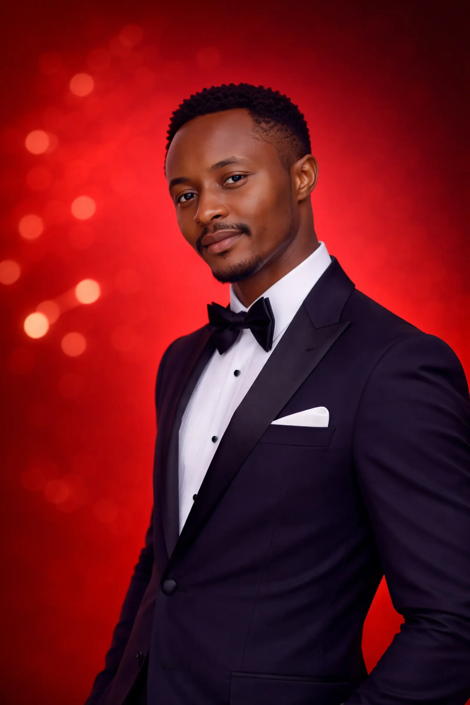

---

## 📸 Preview

## 📈 What I Learned

While building this project, I improved my skills in:
- Responsive design principles
- Animation with GSAP
- Performance optimization (image formats like WebP)
- UI/UX structuring and layout planning

---

## 🔗 Connect With Me

- 💻 GitHub: https://github.com/davienjo
- 📧 Email: thaividz2@gmail.com  

---

## 📌 Future Improvements

- Add backend (PHP / Node.js) for contact form
- Improve accessibility (ARIA roles, better semantics)
- Add dark/light mode toggle
- More advanced animations and transitions

---

## ⭐️ Show Your Support

If you like this project, feel free to ⭐️ the repo and connect with me!
